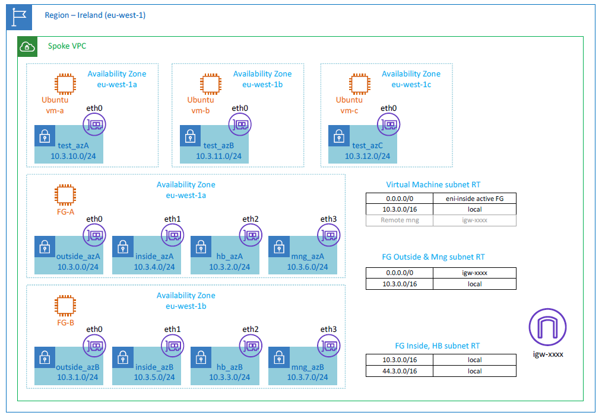

# Spoke VPC with FortiGate-VM Firewall

## Description
By these terraform templates can be deployed one VPC that consists of three test Ubuntu instances and two FortiGate-VM EC2 instances. These two FortiGate-VM forms an active/standby HA cluster that provides service insertion into traffic egressing VPC.
Terraform deploys all resources but does not configure the cluster functionality itself. Follow the steps from the guideline to make the cluster fully operational



Keep in mind that access to the firewall management is allowed remotely only from IP addresses defined by the variable "mng_access_from".

## Prerequisites
- Configure IAM role. An example of a role used with this deployment is documented in the [IAM_role.PNG](documents/IAM_role.PNG).
- Two licenses for FortiGate-VM. Each instance requires own license.
- The FortiGate-VM cluster requires instances with at least four interfaces supported by t3.xlarge size and higher.

## Deployment

- Update terraform variables to customize your deployment.
- Deploy all resources by using terraform.
- Connect to the firewall management on the public IP address assigned to the outside interfaces.
- Activate the license and configure hostname.
- It's recommended to connect to inside interface (port2) from a virtual machines in the cloud prior to modifying the outside interface.
- Configure static addresses and static routes in the FortiGate VMs.
- Disassociate the EIP from the FotiGate-VM B (it's not longer needed).
- Configure HA in active/standby mode.
- Access the CLI through SSH on the dedicated mng interface (port4).
- Configure a firewall policy to enable outgoing traffic
- Add the default route into the routing table rt-internal pointing to port2 eni of the active firewall instance.
- Perform HA failover tests.

More information about post-deployment settings can be found in the the document [FortiGate_HA_next_steps_todo_manually.pdf](documents/FortiGate_HA_next_steps_todo_manually.pdf).

## AWSD debug

When the slave node takes over the master role it also triggers scripts to modify the routing table used for forwarding data to the firewall. At that time the default route is updated with another eni-* belonging to formerly slave instance.
And the second operation the script takes care of is re-association of the EIP applied on the outside interface and move sit to new master instance.

```shell
FG-B # di de en

FG-B # di de application awsd -1
Debug messages will be on for 30 minutes.

FG-B #
FG-B # Become HA master
send_vip_arp: vd root master 1 intf port1 ip 10.3.1.10
send_vip_arp: vd root master 1 intf port2 ip 10.3.5.10
awsd get instance id i-0126f330220ac6e91
awsd get iam role NextGenFirewallHA
awsd get region eu-west-1
awsd get vpc id vpc-0bfa0c90a160e582f
awsd doing ha failover for vdom root
awsd associate elastic ip for port1
awsd associate elastic ip allocation eipalloc-0f7140ed02e5ea7c0 to 10.3.1.10 of eni eni-0eec9e5b7a796d291
awsd associate elastic ip successfully
awsd associate elastic ip for port2
awsd update route table rtb-061c31bc5c6b27bad, replace route of dst 0.0.0.0/0 to eni-009d4682c3561e457
awsd update route successfully

```


