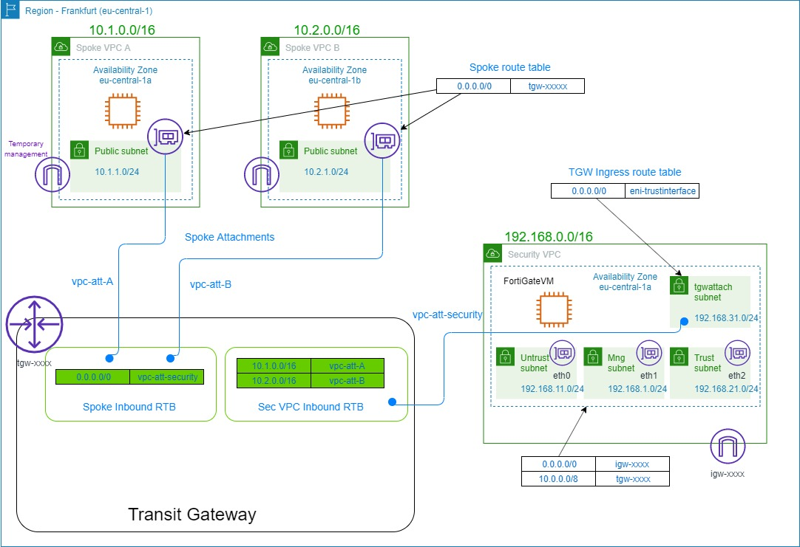

# Service insertion with FortiGateVM

## Description
Spoke VPCs are connected to a transit gateway which enables service insertion to happen. All inter VPC traffic as well as outgoing traffic to the internet is controled by FortiGateVM firewall running in the security VPC.
The transit gateway in this case is attached to all spoke VPCs via VPC connections but it the solution is also open to use also VPN connections to remote VPCs.

The FortiGate VM si connected to three networks untrust, trust and dedicated management interface. Adding additional spoke VPCs doesn't require more network interfaces. The inter spoke VPC traffic is forwarded through the trust interface.


## Deployment by Terraform
The whole setup including the FortiGateVM EC2 instance and testing VMs in spoke VPCs can be deployed by using terraform.


## Network diagram

The diagram can be found also in the pdf file [diagram.pdf](diagram.pdf). 

## Access
There is one test VM deployed in each spoke VPC to perform connectivity tests. These VMs are accessible by using the ssh key created during the deployment. 

## Check connectivity between the endpoints.
Ping from the VM in the VPC-A

```shell
ubuntu@ip-10-1-1-60:~$ ping 10.2.1.143
PING 10.2.1.143 (10.2.1.143) 56(84) bytes of data.
64 bytes from 10.2.1.143: icmp_seq=1 ttl=61 time=2.02 ms
64 bytes from 10.2.1.143: icmp_seq=2 ttl=61 time=1.57 ms
^C
--- 10.2.1.143 ping statistics ---
2 packets transmitted, 2 received, 0% packet loss, time 1001ms
rtt min/avg/max/mdev = 1.579/1.800/2.021/0.221 ms
ubuntu@ip-10-1-1-60:~$ ping 8.8.8.8
PING 8.8.8.8 (8.8.8.8) 56(84) bytes of data.
64 bytes from 8.8.8.8: icmp_seq=1 ttl=47 time=1.89 ms
64 bytes from 8.8.8.8: icmp_seq=2 ttl=47 time=1.61 ms
^C
--- 8.8.8.8 ping statistics ---
2 packets transmitted, 2 received, 0% packet loss, time 1001ms
rtt min/avg/max/mdev = 1.618/1.754/1.890/0.136 ms
```
Ping from the VM in the VPC-B

```shell
ubuntu@ip-10-2-1-143:~$ ping 10.1.1.60
PING 10.1.1.60 (10.1.1.60) 56(84) bytes of data.
64 bytes from 10.1.1.60: icmp_seq=1 ttl=61 time=2.13 ms
64 bytes from 10.1.1.60: icmp_seq=2 ttl=61 time=1.75 ms
^C
--- 10.1.1.60 ping statistics ---
2 packets transmitted, 2 received, 0% packet loss, time 1001ms
rtt min/avg/max/mdev = 1.753/1.942/2.132/0.194 ms
ubuntu@ip-10-2-1-143:~$ ping 8.8.8.8
PING 8.8.8.8 (8.8.8.8) 56(84) bytes of data.
64 bytes from 8.8.8.8: icmp_seq=1 ttl=47 time=2.27 ms
64 bytes from 8.8.8.8: icmp_seq=2 ttl=47 time=2.13 ms
^C
--- 8.8.8.8 ping statistics ---
2 packets transmitted, 2 received, 0% packet loss, time 1001ms
rtt min/avg/max/mdev = 2.131/2.202/2.274/0.085 ms
```